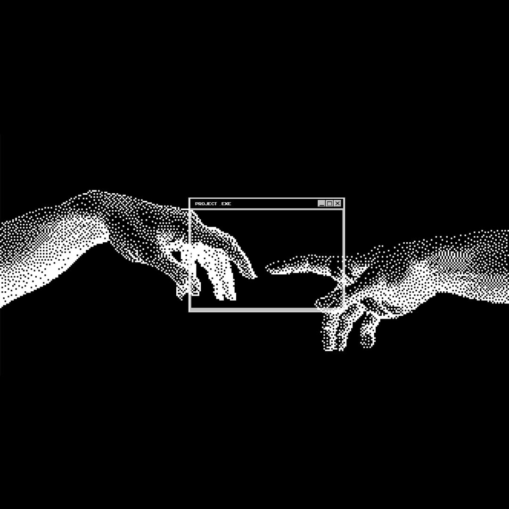

 

 

## 🧠 Sobre mim

Fala! Me chamo **Marlon**, tenho 22 anos e sou carioca. Sou desenvolvedor front-end apaixonado por transformar interface bagunçada em algo que as pessoas realmente conseguem usar sem xingar o computador.

Gosto de deixar cada detalhe redondo — desde a paleta de cores até o `useEffect` que quase virou um loop infinito. Sempre buscando evoluir de acordo com o que o mercado (e a curiosidade) pedem.

 

## 🔥 Principais Projetos

- 📚 **[Biblioteca de Jogos](https://github.com/marlinhoxz/biblioteca)** — Biblioteca digital para organizar e visualizar sua coleção de jogos. Modo escuro, navegação fluida com Lenis e menu lateral com filtros por categoria. `Next.js 15` · `TypeScript`
- 💰 **[Projeto Dashboard](https://github.com/marlinhoxz/Projeto-Dashboard)** — Dashboard financeiro com widgets de cartões, transações, orçamento, poupança e empréstimos. Componentizado, com CSS Modules e tipagem forte. `Next.js 16` · `React 19` · `TypeScript`
- 🩺 **Lista de Soros** — App de contagem de medicamentos e controle de soros por sala, porque plantão não perdoa planilha bagunçada.

 

## 🛠️ Linguagens e Tecnologias

  

 

## 🔌 Conectar

 

<i>Código nunca está pronto. Só fica ligeiramente menos vergonhoso com o tempo.</i>
 
<i>Cada commit que eu faço é basicamente um pedido de desculpas antecipado pro meu eu do futuro.</i>

 

## 📊 Contribuições

  

  

 

  

